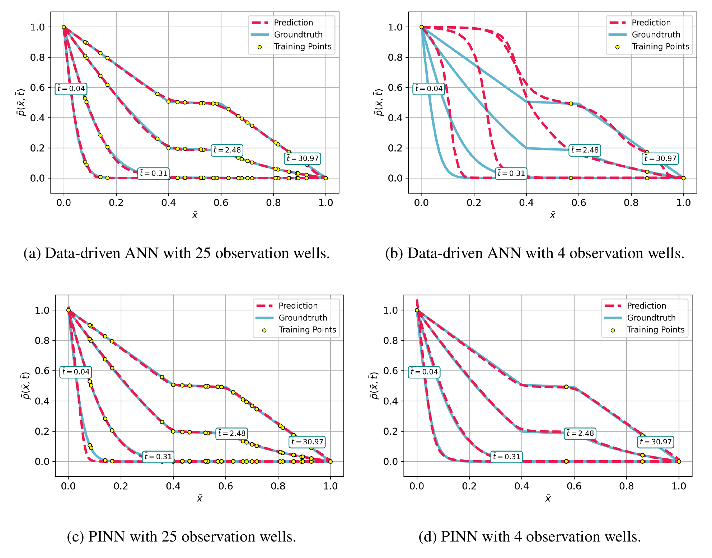

# FlowPINN Model

This repository contains all code and data relevant for reproducing the results of our paper "Bridging the Gap for Sparse Observations: Data-Driven versus Physics-Informed Neural Networks for Hydrogeological Applications".
This readme was tested under Manjaro Linux. It should work similarly under Windows/Mac.

## 1. Prerequisites: Download Anaconda and Setup Anaconda Environment
For creating the virtual environment, we use [Miniconda](https://docs.anaconda.com/miniconda/) which is a light version of [Anaconda](https://docs.anaconda.com/anaconda/install/). Please make sure that you have one of them installed on your machine.

Open the terminal/command line and type the following commands:
```bash
#clone repository on your computer
git clone https://github.com/linuswalter/PINN-for-Subsurface-Flow

# Install from file
conda env create -f environment.yml
conda activate FlowPINN
```

We recommend to use our code in [VSCode](https://code.visualstudio.com/) in combination with the [IPython Extension](https://marketplace.visualstudio.com/items?itemName=HoangKimLai.ipython) which allows you to run code cells separately.

## 1. Data
The `01_data` directory contains the csv-files `ogs_output_a_1e0.csv` and `ogs_output_a_5e0.csv` which contain the synthetic datasets for an equivalent fracture length of a=1m and a=5m. These are outputs from the numerical code [OpenGeoSys](https://www.opengeosys.org/). To make these outputs more reproducible, we also appended the directories `model_a_1e0`  and `model_a_5e0` which contain the respective mesh files (See `mesh`-directory, the project file `LiquidFlow.prj` for running the OGS model and the OGS output files in the `pvd` and `vtu` format. The file `LiquidFlow_.pvd` can be viewed in the interactive GUI of [ParaView](https://www.paraview.org/).

## 2. Experiments

To reproduce the experimental results, just start initialize and run the Jupyter Notebook.
The model can be parameterized in the section "Experimental Parameters".

### 2.1 Experiment ANN versus PINN

For reproducing the first experiment, you need to select the following options when setting up the experiment parameters:

```
Name Ground Truth Dataset = ogs_output_a_5e0
Load weights for kd? = False
Load weights for pd_pinn? = False
Number Epochs Training kd = 500
Number Epochs pd = 1000
Perform retraining for too high loss values? = False
Number of Iterations = 1
Nr observation points = 25
Standard Deviation of the Gaussian Noise = 0
PINN with observation loss term? = True
Learning Rate values = [0.001, 1e-05]
Learning Rate method = step
Adaptive Weighting = None
Safe Plots as PNG? = True
Create GIF of PNG? = True
```

In the second part of the first experiment, one can set the experiment parameter `Standard Deviation of the Gaussian Noise` to a higher value, like σ = 0.02 or σ=0.04.

**Expected Results:**


### 2.2 PINN with high Permeability Contrast and no Observation Points

The second experiment can be reproduced by choosing the following parameter settings.

```
Name Ground Truth Dataset = ogs_output_a_1e0
Load weights for kd? = False
Load weights for pd_pinn? = False
Number Epochs Training kd = 300
Number Epochs pd = 500
Perform retraining for too high loss values? = True
Error Treshold for Retraining PINN = 0.0001
Number of Iterations = 20
Nr observation points = 0
Standard Deviation of the Gaussian Noise = 0
PINN with observation loss term? = False
Learning Rate values = [0.001, 1e-05]
Learning Rate method = step
Adaptive Weighting = None
Safe Plots as PNG? = True
Create GIF of PNG? = True
```

**Expected Result:**


### Model Output
The results will be saved in the directory `02_model_output` -> `model_DATE_TIME`

